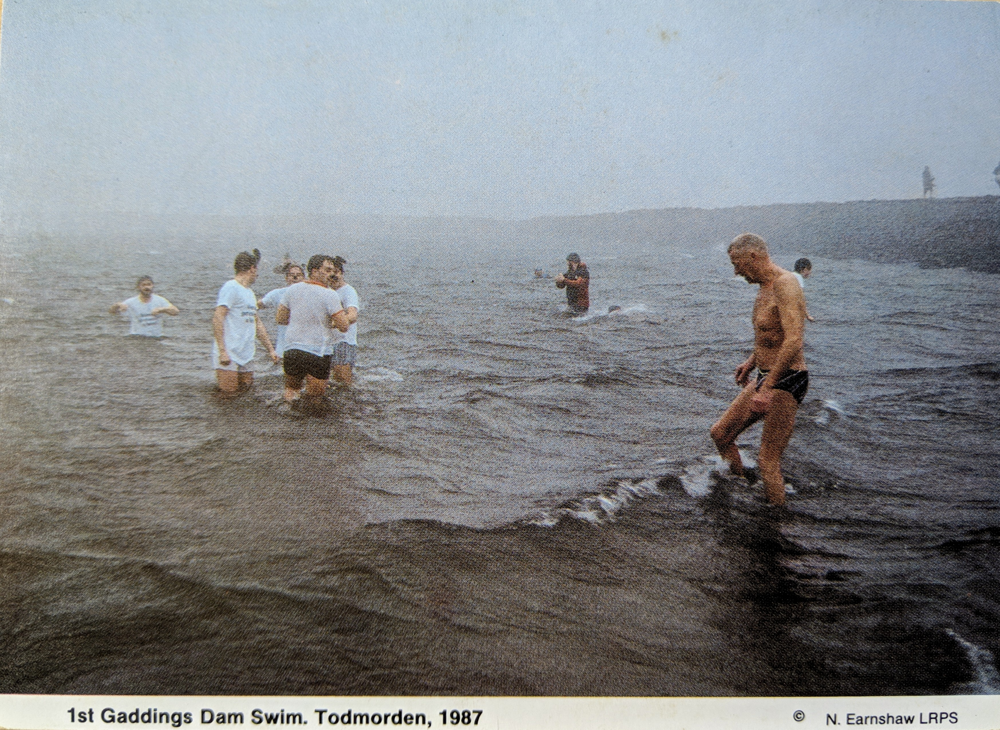

# Gaddings Dam, Todmorden. First Swim 1987
#### 28th April 2019  
OS Grid Ref: [SD 94827 22566](https://www.ordnancesurvey.co.uk/osmaps/54.59153647477209,-2.760190210819311,17.723546981811523/pin/)  
Geo URI: `geo:53.6980,-2.0792`  
Latitude: 53° 41' 58" N  
Longitude: 2° 4' 47" W

Old postcard: _1st Gaddings Dam Swim. Todmorden, 1987_

From [gaddingsdam.org](https://www.gaddingsdam.org/):

> Gaddings Dam is an 1833 earth embankment dam located on top of the moors between Todmorden and Walsden. Constructed to supply water to the mills of Lumbutts, the reservoir fell into disuse when the mills began to use steam power.
Slated to be drained in 2001 due to its poor condition, the reservoir was rescued by a determined group of locals who bought the dam, repaired it, and now continue to maintain it to the standards required by the regulations.

   
