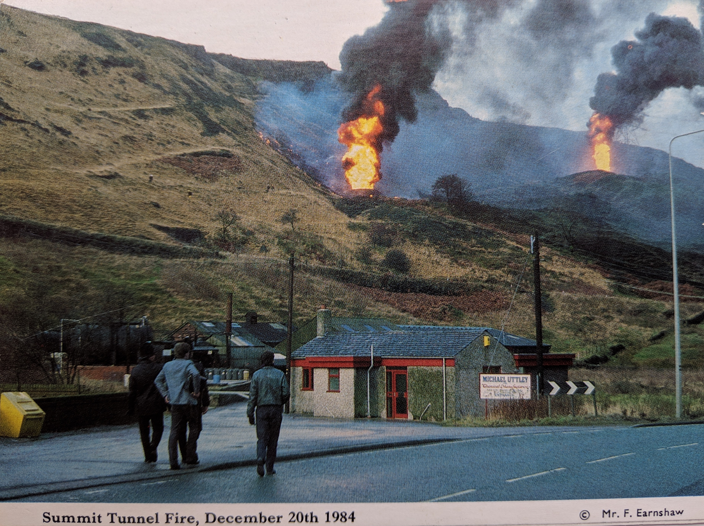

# Summit Tunnel Fire. December 20th 1984
#### 05th May 2019  
OS Grid Ref: [SD 94522 18542](https://www.ordnancesurvey.co.uk/osmaps/53.664104821167314,-2.084343430209656,17.0/pin/)  
Geo URI: `geo:53.6641,-2.0843`  
Latitude: 53° 39' 48" N  
Longitude: 2° 5' 3" W

Old postcard: _Summit Tunnel Fire. December 20th 1984_

from [Wikipedia](https://en.wikipedia.org/wiki/Summit_Tunnel_fire):   
> On 20 December 1984 a dangerous goods trainpassing through the Summit Tunnel on the Greater Manchester/West Yorkshire border, caught fire on the rail line between Littleborough and Todmorden, England.

More details at  [railmagazine.com](https://www.railmagazine.com/infrastructure/trackside/summit-tunnel-from-fire-to-ice)

   
