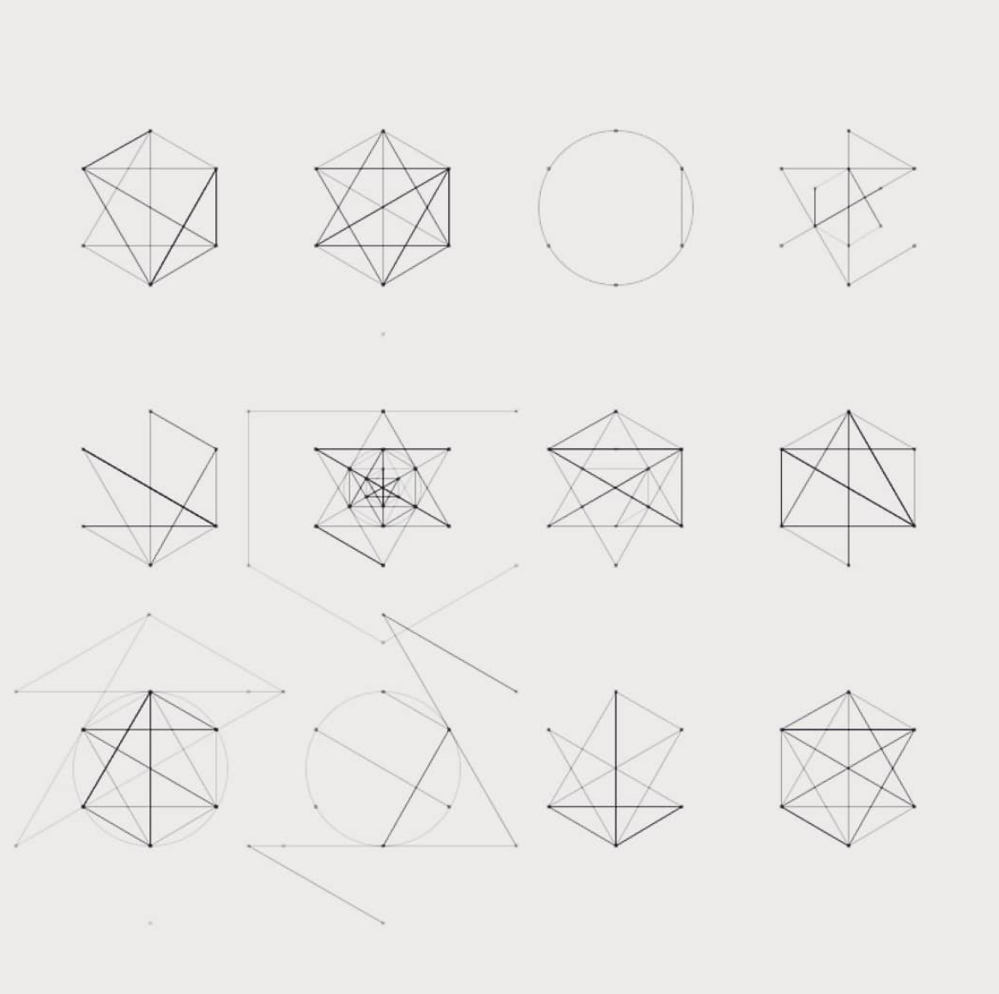
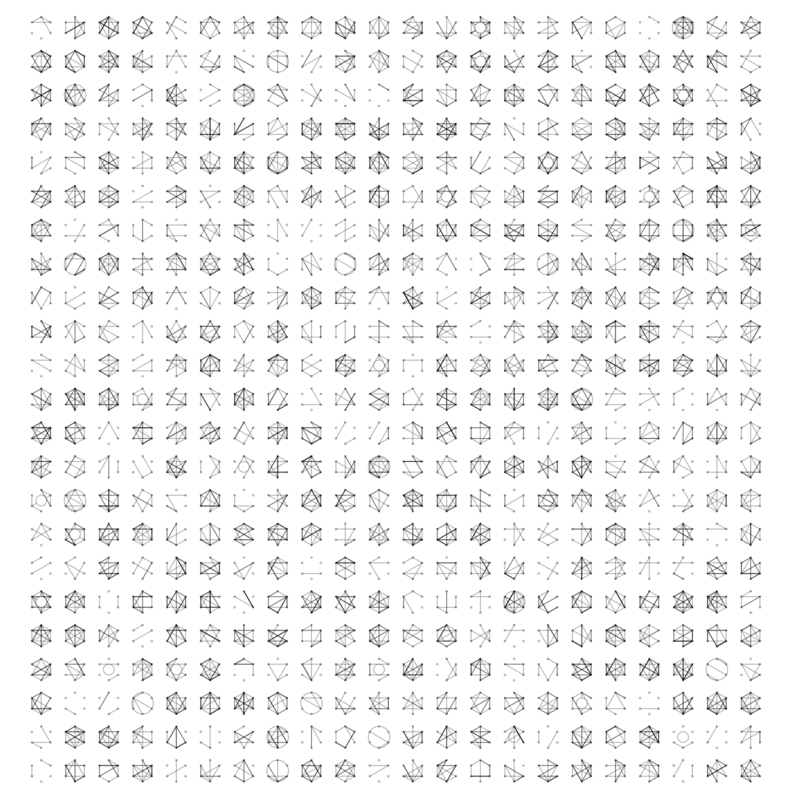

# Hexagrams



I wrote this a while back after a Todmorden local posted some [hexagram](https://en.wikipedia.org/wiki/Hexagram) sketches he'd done on Instagram.



To run yourself: download [Processing](https://processing.org) and copy the source below. Click the mouse to generate a new matrix, each time a .pdf is saved in the sketch folder (find it from within Processing by selecting the Sketch menu then _Show Sketch folder_ - if you want an .svg use an [online pdf to svg converter](https://cloudconvert.com/pdf-to-svg))

```

import processing.pdf.*;

int VERTEXES = 6;
int columns = 24;
int rows = 24;

final float RADS = TWO_PI/VERTEXES;
PFont font;

PVector h1 = new PVector(0.0, 100.0);
PVector h2 = new PVector(86.60254, 50.0);
PVector h3 = new PVector(86.60254, -50.0);
PVector h4 = new PVector(0.0, -100.0);
PVector h5 = new PVector(-86.60254, -50.0);
PVector h6 = new PVector(-86.60254, 50.0);

PVector[] hexPoints = new PVector[]{h1, h2, h3, h4, h5, h6};

int hexagramCount = 0;

void setup(){
  size(1000, 1000);
}

void draw(){
  background(255);

  beginRecord(PDF, "hexagrams.pdf");

  int columnWidth = width/columns;
  int columnHeight = height/rows;
  for(int y = 0 ; y < height ; y += columnHeight){
    for(int x = 0 ; x < width ; x += columnWidth){
      if(x > (columnWidth/2) && x < width - (columnWidth*2)){
        if(y > (columnHeight/2) && y < height - (columnHeight)){
          hexagramCount++;
          new Hexagram(x + columnWidth/2, y + columnHeight/8, columnWidth/3, 0x55000000).draw();
        }
      }
    }
  }

  endRecord();

  noLoop();
}

void mousePressed(){
  hexagramCount = 0;
  loop();
}

class Hexagram{

  float x;
  float y;
  float radius;
  int strokeVal;

  Hexagram(float x, float y, float radius, int strokeVal){
    this.x = x;
    this.y = y;
    this.radius = radius;
    this.strokeVal = strokeVal;
  }

  void draw(){
    stroke(strokeVal);
    for(int i = 0 ; i < VERTEXES; i++){
     float xx = radius*sin(RADS*i) + x;
     float yy = radius*cos(RADS*i) + y;
     //point(xx, yy);
     ellipse(xx, yy, 2, 2);
     hexPoints[i] = new PVector(xx, yy);
    }

    int lines = (int) random(30) + 2;
    //Steadily increase lines per Hexagram
    //lines = (int)map( (float) hexagramCount, 1f, columns*rows, 1f, 40f);

    for(int i = 0 ; i < lines; i++){
      int index1 = (int) random(0, VERTEXES);
      int index2 = (int) random(0, VERTEXES);
      line(hexPoints[index1].x, hexPoints[index1].y, hexPoints[index2].x, hexPoints[index2].y);
    }

    float rand = random(100);

    if(rand < 5) {
      if(random(100) < 50){
        noFill();
      }else{
        fill(255);
      }
      ellipse(x, y, radius, radius);
    }else if(rand < 10) {
      noFill();
      ellipse(x, y, radius*2, radius*2);
    }else if(rand < 20) {
      //new Hexagram(x, y, radius/2, 0x33000000).draw();
    }else if(rand < 30) {
      //new Hexagram(x, y, radius*2, 0x33000000).draw();
    }
  }
}

```
