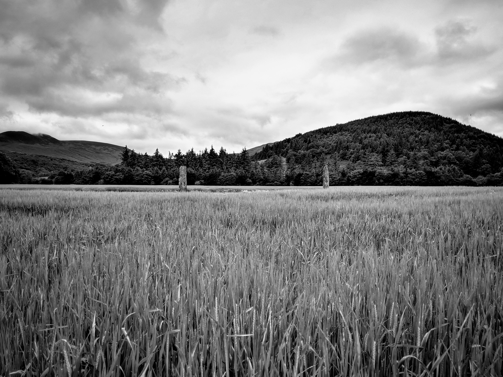
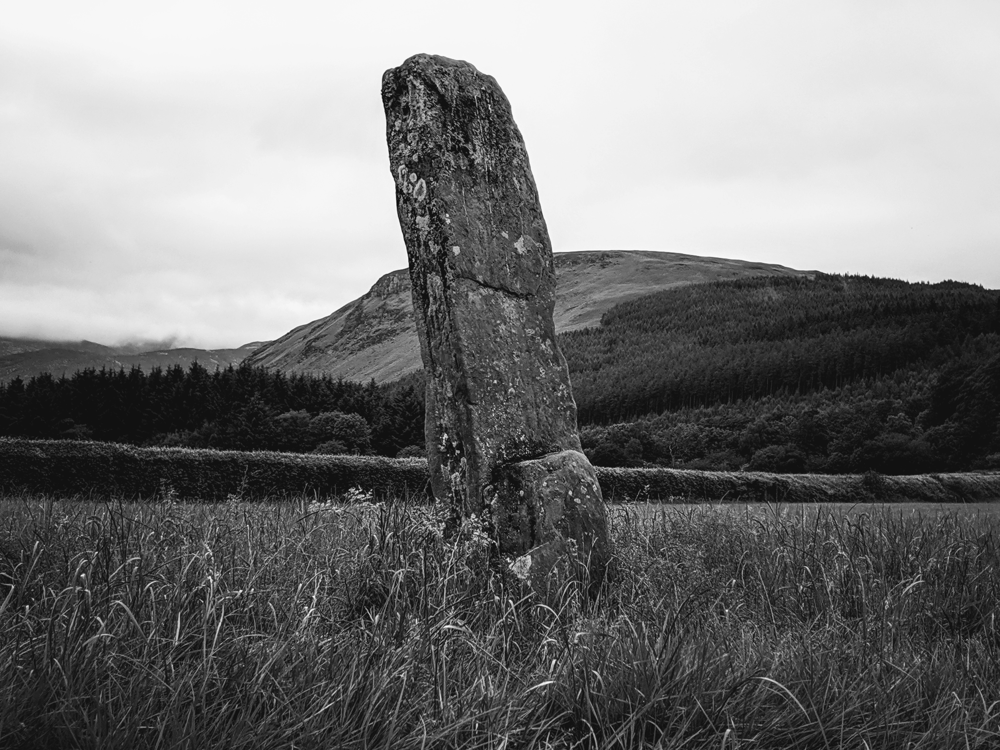

<!--- -image_format jpeg_high -->
# Brodick 'Deer Park' Standing Stones, Cladach, Arran  
#### 24th June 2019  
OS Grid Ref: [NS 00661 37436](https://osmaps.ordnancesurvey.co.uk/55.58964112993499,-5.164788690645112,17.989999771118164/pin/)  
Geo URI: `geo:55.5896,-5.1647`  
Latitude: 55° 35' 22" N  
Longitude: 5° 9' 53" W  

Three standing stones separated by a road. The larger two were surrounded with barley crop so we couldn't get close.

