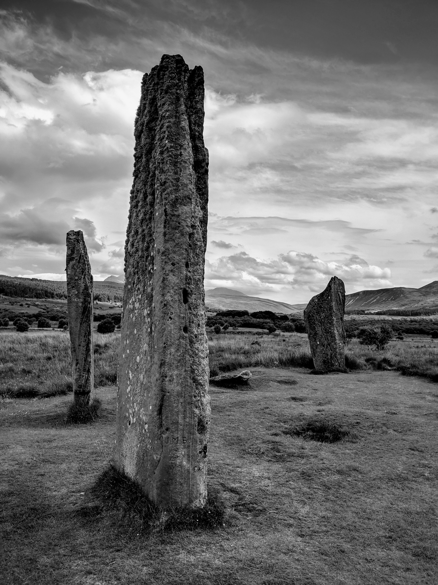

<!--- -image_format jpeg_high -->
# Machrie Moor Standing Stones, Arran  
#### 25th June 2019  
OS Grid Ref: [NR 91123 32414](https://osmaps.ordnancesurvey.co.uk/55.5406,-5.31207,16.514429092407227/pin/)  
Geo URI: `geo:55.5406, -5.3120`  
Latitude: 55° 32' 26" N  
Longitude: 5° 18' 43" W  

