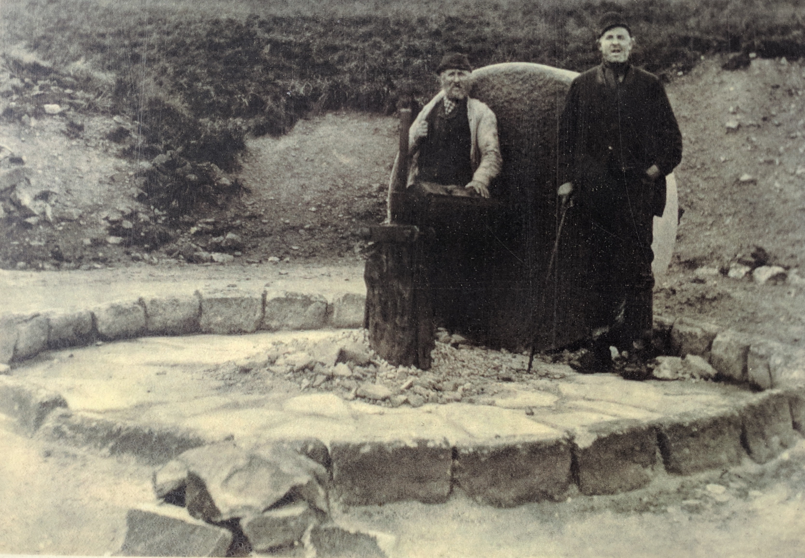

<!--- -convert_greyscale -->

# Flower Scar Stone Crusher
#### 27th August 2019
OS Grid Ref: [SD 91130 25068](https://osmaps.ordnancesurvey.co.uk/53.72195,-2.13588,16/pin)  
Geo URI: `geo: 53.7219, -2.1358`  
Latitude: 53° 43' 19" N
Longitude: 2° 8' 9" W  

On the Flower Scar Road turnoff,  Todmorden, where the tarmacked road becomes Tower Causeway there's a information sign about the 'Flow Scar stone crusher', a huge milling stone used to crush sandstone at Guide Quarry. The stone has been removed (purloined) and moved across the county border to Bacup Natural History Society.

