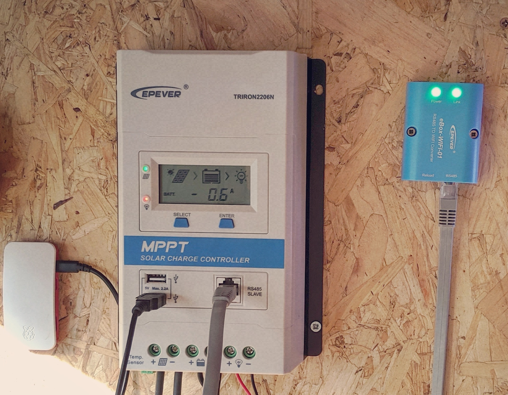

<!--- -convert_greyscale -if jpeg_high -bg #f3ecde -->
# EPEver eBox WiFi



EPEver have a RS485 to WiFi (RJ45 serial interface) dongle for use with their solar charge controllers. Unfortunately the WiFi operates in Access Point mode which means in order to use it you need to disconnect from your own network and directly connect to the dongle's SSD, it's only designed to be used with their Android or iOS apps, or their Windows-only desktop software.

## Fixing eBox WiFi

The eBox does have port 80 open and includes an undocumented web dashboard. Browse to http://11.11.11.254/ and enter username: `admin` and password: `admin`. Older versions of this web dashboard are in Chinese ([see Adam Welch's YouTube video](https://www.youtube.com/watch?v=uFURiLmQds0)) but my newer version is mostly in English. The eBox did at some point support station mode but it's been hobbled by EPEver for some reason, it's only hidden in the web interface though, the functionality remains, so if you [download this html page](select_cn.shtml) and open it you should be able to set station mode (be sure to scan for and enter the credentials of your home WiFi elsewhere in the dashboard before doing this).

Following successfully setting up station mode and restarting the dongle I checked for new connections on my home WiFi and found a new device with SSID of _lierda_liLink_e86164_ and ip address http://192.168.86.24/ (yours will be different, this is assigned via [DHCP](https://en.wikipedia.org/wiki/Dynamic_Host_Configuration_Protocol)). Using the same credentials as before you can now use the dashboard and access any services from your regular network. This will break the iOS/Android apps which have a hard-coded IP address for the box (if you really wanted to you could configure your network to redirect to the correct ip address, or even decompile the app, change the ip, rebuild and self-sign). Since we want to log data using a Raspberry Pi losing the (pretty mediocre) apps is fine.

## Retrieve Data

If you run a port scan on the eBox IP address you should see two ports open: 80 for the web dashboard and 8088 for the [modbus](https://en.wikipedia.org/wiki/Modbus) interface.

First step is to set up a serial relay using [socat](https://medium.com/@copyconstruct/socat-29453e9fc8a6) so a local Python script can communicate with the solar controller, there was a lot of trial and error here, so I'm not 100% on the correctness of what I came up with however this worked:

```
sudo socat -d -d pty,raw,echo=0,waitslave tcp:192.168.86.24:8088
sudo chmod 777 /dev/ttys002
```

The Python script was also cobbled together from various sources (by Googling 'modbus python epever'), then expanded by referring to the [EPEVER Modbus pdf](1733_modbus_protocol.pdf), it uses the open source [PyModBus](https://github.com/riptideio/pymodbus) library. Other people have reported various issues with baudrate and timeout length but since this will only run once every five minutes via a cron task (as opposed to a realtime interface) none of these issues manifest.

```
import logging
import os
from pymodbus.client.sync import ModbusSerialClient as ModbusClient

# logging.basicConfig()
# log = logging.getLogger()
# log.setLevel(logging.DEBUG)

# EPEver Realtime addresses
addr_realtime_pv_array_voltage_v = 0x3100
addr_realtime_pv_array_current_a = 0x3101
addr_realtime_pv_array_power_low_w = 0x3102
addr_realtime_pv_array_power_high_w = 0x3103
addr_realtime_battery_voltage_v = 0x3104
addr_realtime_battery_charging_current_a = 0x3105
addr_realtime_battery_charging_power_low_w = 0x3106
addr_realtime_battery_charging_power_high_w = 0x3107
addr_realtime_load_voltage_v = 0x310C
addr_realtime_load_current_a = 0x310D
addr_realtime_load_power_w = 0x310E
addr_realtime_battery_temp_c = 0x3110
addr_realtime_charge_controller_temp_c = 0x3111
addr_realtime_heat_sink_temp_c = 0x3112
addr_realtime_battery_remaining_percentage = 0x311A
addr_realtime_battery_sensor_temp_c = 0x311B
addr_realtime_battery_status = 0x3200
addr_realtime_charging_equipment_status = 0x3201


def read_param(addr):
    register = modbus_client.read_input_registers(addr, 1, unit=1)
    if not register.isError():
        value = float(register.registers[0] / 100.0)
        return value
    else:
        return -1


def read_percent_param(addr):
    register = modbus_client.read_input_registers(addr, 1, unit=1)
    if not register.isError():
        return register.registers[0]
    else:
        return -1


# I should be using Pythons excellent json methods but I'm not
def add_json_value(file, param, value):
    file.write("\t\t{\n\t\t\t\"param\": \"" + param + "\",\n")
    file.write("\t\t\t\"value\": \"" + value + "\"\n\t\t},\n")


# There's no easy way in Python to remove the last char in a file, so just add this extra method with no trailing comma
def add_last_json_value(file, param, value):
    file.write("\t\t{\n\t\t\t\"param\": \"" + param + "\",\n")
    file.write("\t\t\t\"value\": \"" + value + "\"\n\t\t}\n")


solar_params = open("solar_params.json", "w+")
solar_params.write("{\n\t\"values\": [\n")

modbus_client = ModbusClient(
    method='rtu', port='/dev/ttys004',
    stopbits=1, bytesize=8, parity='N',
    baudrate=115200, timeout=5
)

if modbus_client.connect():
    realtime_pv_array_voltage_v = read_param(addr_realtime_pv_array_voltage_v)
    print("Solar Array Voltage: " + str(realtime_pv_array_voltage_v))
    add_json_value(solar_params, "Solar Array Voltage", str(realtime_pv_array_voltage_v))

    realtime_pv_array_current_a = read_param(addr_realtime_pv_array_current_a)
    print("Solar Array Current (Amps): " + str(realtime_pv_array_current_a))
    add_json_value(solar_params, "Solar Array Current (Amps)", str(realtime_pv_array_current_a))

    realtime_pv_array_power_low_w = read_param(addr_realtime_pv_array_power_low_w)
    print("Solar Array Power Watts (low): " + str(realtime_pv_array_power_low_w))
    add_json_value(solar_params, "Solar Array Power Watts (low)", str(realtime_pv_array_power_low_w))

    realtime_pv_array_power_high_w = read_param(addr_realtime_pv_array_power_high_w)
    print("Solar Array Power Watts (high): " + str(realtime_pv_array_power_high_w))
    add_json_value(solar_params, "Solar Array Power Watts (high)", str(realtime_pv_array_power_high_w))

    realtime_battery_voltage_v = read_param(addr_realtime_battery_voltage_v)
    print("Battery Voltage: " + str(realtime_battery_voltage_v))
    add_json_value(solar_params, "Battery Voltage", str(realtime_battery_voltage_v))

    realtime_battery_charging_current_a = read_param(addr_realtime_battery_charging_current_a)
    print("Battery Charging Current (Amps): " + str(realtime_battery_charging_current_a))
    add_json_value(solar_params, "Battery Charging Current (Amps)", str(realtime_battery_charging_current_a))

    realtime_battery_remaining_percentage = read_percent_param(addr_realtime_battery_remaining_percentage)
    print("Battery Remaining: " + str(realtime_battery_remaining_percentage) + "%")
    add_last_json_value(solar_params, "Remaining Battery", str(realtime_battery_remaining_percentage))

    solar_params.write("\t]\n}")

else:
    print('Modbus connection error')

solar_params.close()
modbus_client.close()

```

You can then run socat and the Python script together:

```
socat -d -d pty,raw,waitslave,echo=0 2>socat_log.txt tcp:192.168.86.24:8088& python fisk_epever_modbus_b.py
```

This will open a serial relay, try and fetch the modbus params, then close. If you put this command in a crontab job you'll get periodic reporting on the solar array and battery status.

# Notes

If you somehow brick the eBox EPEver have [supplied instructions](WiFi-module-restore-method-Customer.pdf) for a hard reset (requires disassembly and shorting a couple of connections)

# Links

All the 3rd party files and various information above was pulled together by other people far more skilled than myself:

* [Hacked EPEver Wifi to RS485 Adapter eBox-WIFI-01 - 12v Solar Shed](https://www.youtube.com/watch?v=uFURiLmQds0) - Adam Welch
* [Build Your Own RS485 to Wifi Adapter for EPEver Solar Charge Controllers](http://adamwelch.co.uk/2017/12/build-your-own-rs485-to-wifi-adapter-for-epever-solar-charge-controllers/)
* [EPEver eBox WiFi 01 STA Mode and its own Power Supply](https://www.youtube.com/watch?v=YWnzTsFeh3g) - Stuart Davies
* [EPEver RS485 to WiFi updated board](https://www.youtube.com/watch?v=AqZic-IzFIg&t=337s) - Colin Hickey
* [Epever RS485 to wifi adaptor](https://www.tindie.com/products/plop211/epever-rs485-to-wifi-adaptor-new-revision/) - Colin's own adapter that doesn't require hacking EPEever's eBox.
* [Php EpSolar Tracer Class](https://github.com/toggio/PhpEpsolarTracer)
* [epsolar-tracer](https://github.com/kasbert/epsolar-tracer)
* [EPSolar_Tracer](https://github.com/alexnathanson/EPSolar_Tracer)
* [Epever/Epsolar output to InfluxDB/Grafana](http://blog.eplop.co.uk/2017/06/epeverepsolar-output-to-influxdbgrafana.html)
* [EPSolar Tracer 2210A Charge Controller + Blynk = Epic Solar Monitor](https://community.blynk.cc/t/epsolar-tracer-2210a-charge-controller-blynk-epic-solar-monitor/10596)
