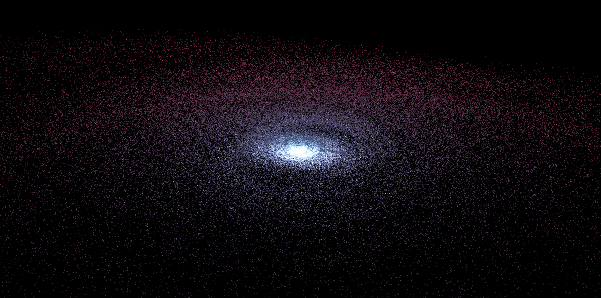

<!--- -convert_none -background #666666 -->
# A galaxy in 36 lines of code



A processing sketch that creates an impressive animation of stars orbiting a black hole. Initially written in Kotlin using ProcKt (my own wrapper around Processing), I ported it back to Java to see how compact I could make the code.

```
ArrayList<PShape> rings = new ArrayList<PShape>();

void setup(){
  size(1200, 600, P3D);
  blendMode(ADD);
  smooth(8);  
  float innerRad = 1f, outerRad = 9f, increment = 1f;
  for(int ringIndex = 0 ; ringIndex < 50 ; ringIndex++){
    PShape ring = createShape();
    ring.setStrokeWeight(1.5f);
    ring.beginShape(POINTS);
    ring.stroke(lerpColor(color(73, 115, 161), color(157, 47, 77), ringIndex/50f), 175f);
    for(int starIndex = 0 ; starIndex < 3000 ; starIndex++){
      float a = random(0f, 1f) * TWO_PI;
      float r = sqrt(random(sq(innerRad), sq(outerRad)));
      ring.vertex(r * cos(a), r * sin(a), random(-increment, increment));
    }
    ring.endShape();
    rings.add(ring);
    innerRad += increment;
    outerRad += increment*1.5f;
    increment += 1;
  }
}

void draw(){ 
  background(0);
  camera(-width/2f, -height/2f, 150f, 0f, 0f, 0f, 0f, 1f, 0f);
  for(int index = 0 ; index < 50 ; index++){
    pushMatrix();
    rotateY((TWO_PI/(index*index)*frameCount)/10);
    rotateX(1.45f);
    shape(rings.get(index));
    popMatrix();
  }
}
```