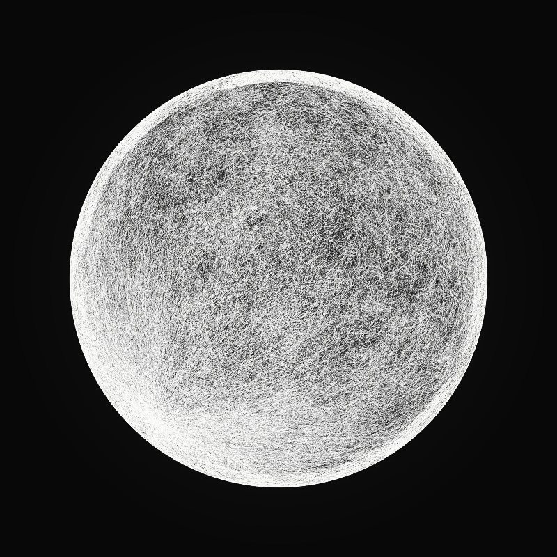
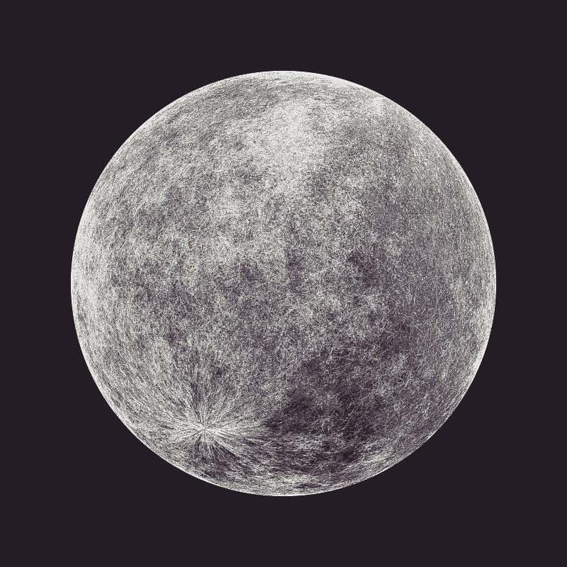
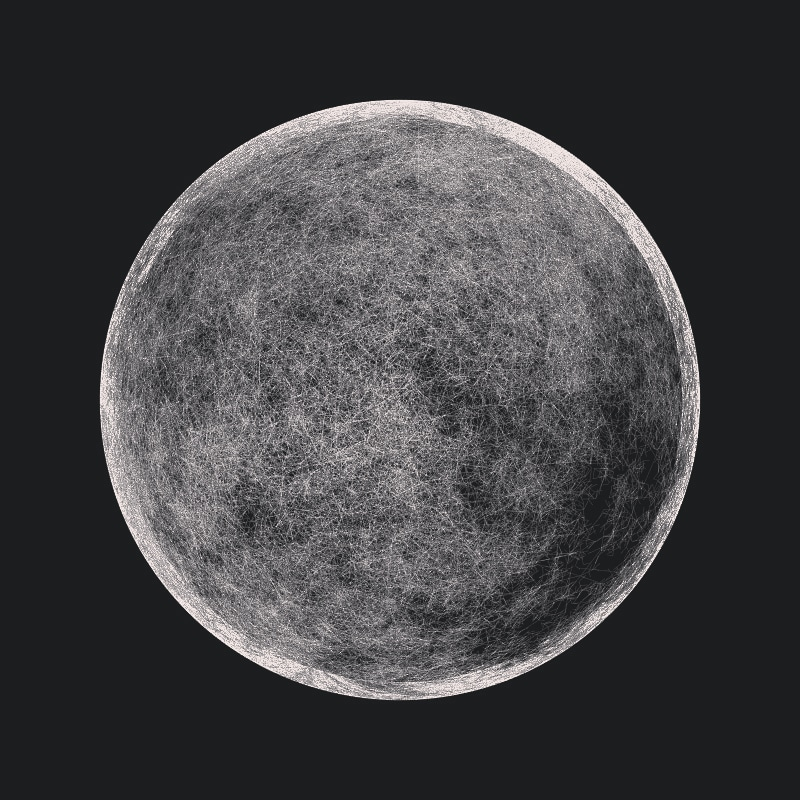

<!--- -convert_greyscale -background #dedfdf -->
# Moons



```
package prockt.sketches

import processing.core.PShape
import prockt.KApplet

/*

    Map random branching shape onto surface of a sphere (iteration 2 - add planet mass)

 */
class Sketch023: KApplet() {

    private lateinit var mappedShape: PShape

    private var lines = mutableListOf<Line>()
    private var terminalLength = 0f
    private var randomAngleDiv = 0f
    private var reduction = 0f
    private var drawPlanetMass = true
    private var exportFrame = false

    override fun settings() {
        size(800, 800, P3D)
        smooth(8)
    }

    override fun setup() {
        blendMode(ADD)
        generate()
        noCursor()
        hint(ENABLE_DEPTH_SORT)
    }

    override fun draw() {
        if (exportFrame) {
            beginRaw(PDF, "moon_frame_${System.currentTimeMillis()}.pdf");
        }

        lights()
        background(EIGENGRAU)

        if(drawPlanetMass) {
            noStroke()
            fill(BLACK)
            sphere(3800f)
        }

        val fov = PI/3f
        val cameraZ = (height/2f) / tan(fov/2f)
        perspective(fov, 1f, cameraZ/10f, 14500f)
        camera(-width/2f, -height/2f, 10050f, 0f, 0f, 0f, 0.0f, 1.0f, 0.0f)

        //rotateY((TAU*frameCount)/3000)
        rotateY((TAU*mouseX)/width)
        rotateX((TAU*mouseY)/height)

        shape(mappedShape)

        if (exportFrame) {
            endRaw()
            exportFrame = false
        }
    }

    override fun mouseClicked() {
        generate()
    }

    override fun keyPressed() {
        when (key) {
            'e' -> exportFrame = true
            'm' -> drawPlanetMass = !drawPlanetMass
        }
    }

    private fun generate(){
        lines.clear()
        terminalLength = random(0.2f, 1f)
        randomAngleDiv = random(2f, 10f)
        reduction = random(1.8f, 2f)
        val origin = Coord(width/2, height/2)
        val dendrites = random(1, 8)

        repeat(dendrites){ index ->
            val angleRnd = random(-1f, 1f)
            var angle = TAU/dendrites * index
            angle += TAU/dendrites
            grow(origin, 85f, angle + angleRnd)
        }

        mappedShape = createShape()
        mappedShape.beginShape(LINES)
        mappedShape.stroke(WHITE, 20f)
        mappedShape.strokeWeight(0.5f)

        val radius = 4000
        repeat(lines.size){index ->
            val line = lines[index]

            val x1 = radius * (sin(line.y1) * cos(line.x1))
            val y1 = radius * (sin(line.y1) * sin(line.x1))
            val z1 = radius * cos(line.y1)
            val start = Particle(x1, y1, z1)

            val x2 = radius * (sin(line.y2) * cos(line.x2))
            val y2 = radius * (sin(line.y2) * sin(line.x2))
            val z2 = radius * cos(line.y2)
            val end = Particle(x2, y2, z2)

            if(start.distanceTo(end) < radius/4) {
                mappedShape.vertex(x1, y1, z1)
                mappedShape.vertex(x2, y2, z2)
            }
        }

        mappedShape.endShape()

    }

    private fun grow(origin: Coord, length: Float, angle: Float){
        when {
            length < terminalLength -> return
        }

        pushMatrix()
        translate(origin.x, origin.y)
        rotate(angle)
        lines.add(Line(screenX(0f, 0f), screenY(0f, 0f), screenX(length, 0f), screenY(length, 0f)))

        var offspringAngle = random(0f, 12f)//PI/6 or something for more order
        grow(Coord(length / reduction, 0f), length / reduction, -offspringAngle)
        grow(Coord(length / reduction, 0f), length / reduction, offspringAngle)

        offspringAngle = random(0f, 12f)
        grow(Coord(0f, 0f), length / reduction, -offspringAngle)
        grow(Coord(length, 0f), length / reduction, -offspringAngle)

        popMatrix()
    }
}
```
