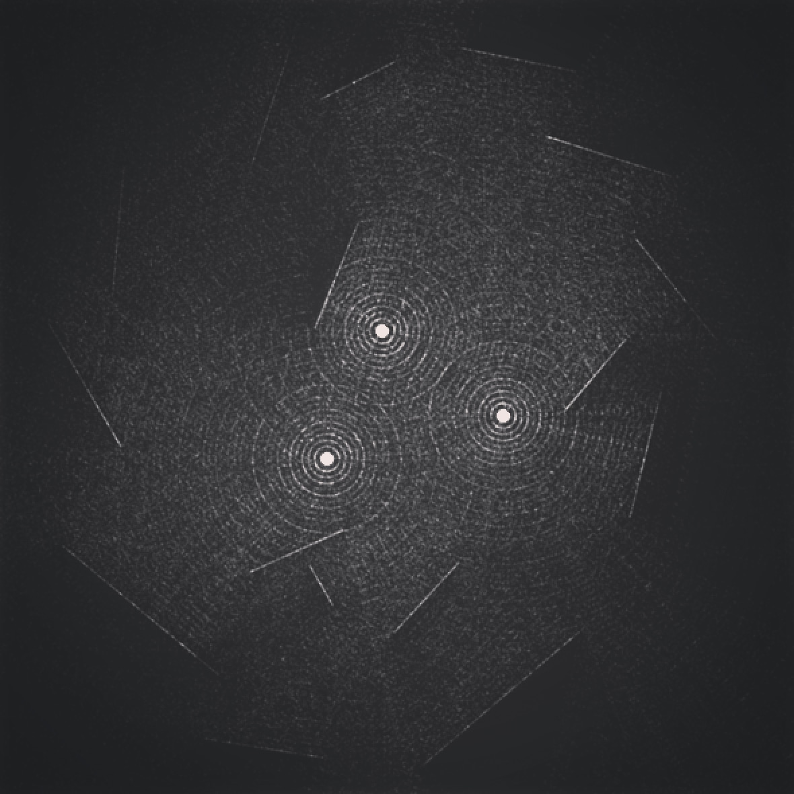
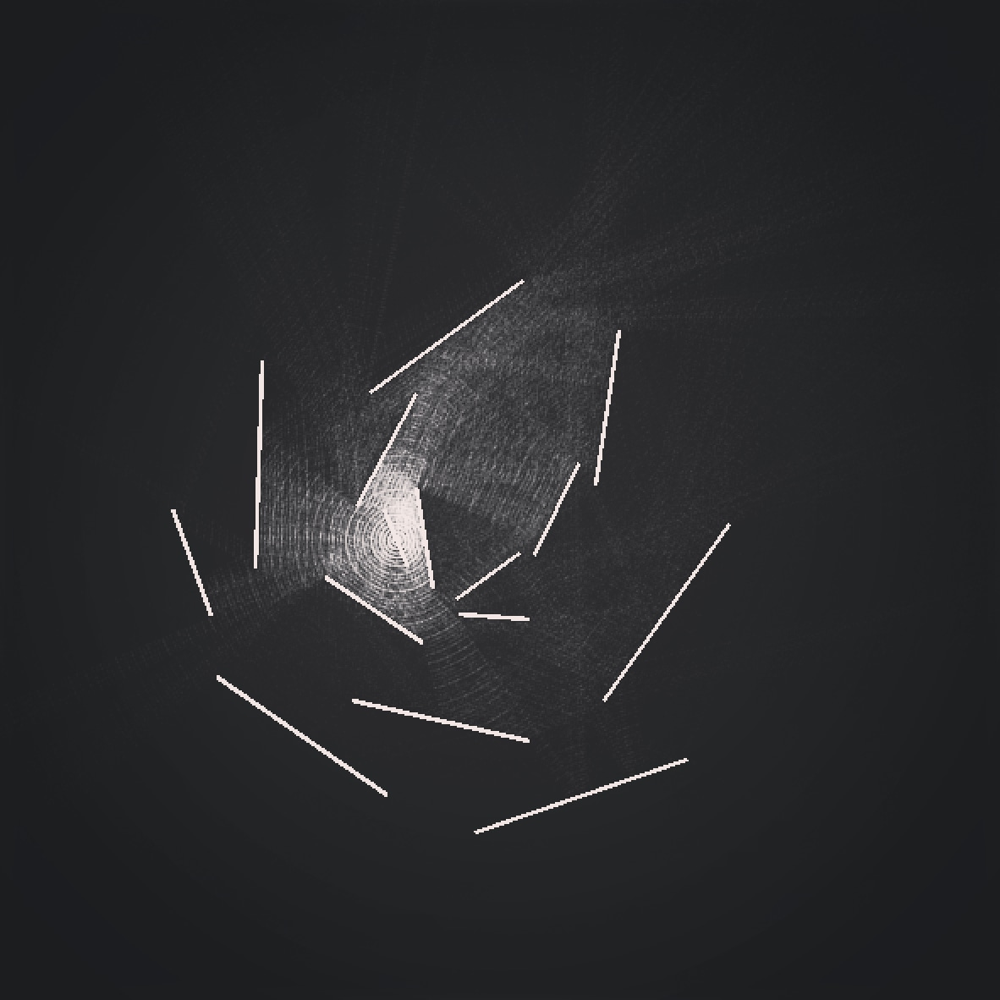

<!--- -convert_greyscale -background #dedfdf -->
# Ray Casting

First attempt at building a basic 2D ray caster. Heavily relies on code from an old [bouncing ball sketch](https://forum.processing.org/two/discussion/10649/forum.processing.org/two/discussion/comment/41640/forum.processing.org/two/discussion/comment/41640/forum.processing.org/two/discussion/comment/41640/forum.processing.org/two/discussion/comment/41640/#Comment_41640), I'll reimplement this with my own logic once I've developed the methods for the new ProcKt KVector class.



```
package prockt.sketches.archive

import prockt.KApplet
import processing.core.PVector
import prockt.api.Coord

/*
    Raycaster
 */
class Sketch026: KApplet() {

    private var mirrorStart: Coord? = null
    private var mirrorEnd: Coord? = null

    private var showObjects = false
    private var setSpeed = false

    private var mirrors = mutableListOf<Mirror>()
    private var rays = mutableListOf<Ray>()

    private var speed: Float = 275f

    private var lights = mutableListOf<Coord>()

    private var currTime: Int = 0
    private var prevTime:Int = 0
    private var deltaTime: Float = 0f


    override fun settings() {
        size(1000, 600, P3D)
        //smooth(8)
        super.settings()
    }

    override fun setup() {
        reset()
        hint(DISABLE_OPTIMIZED_STROKE)
        blendMode(ADD)
    }

    override fun draw() {

        if(showObjects){
            reset()

            mirrors.forEach { mirror ->
                mirror.drawHighlight()
            }
        }

        if(setSpeed){
            speed = mouseY.toFloat()
        }

        currTime = millis()
        deltaTime = (currTime - prevTime)/1000.0f
        prevTime = currTime;

        when {
            mirrorStart != null -> {
                if(!showObjects) reset()
                stroke(MAGENTA)
                line(mirrorStart!!, Coord(mouseX, mouseY))
            }
        }

        lights.forEach {
            rays.add(Ray(Coord(it.x, it.y), random(0f, TAU)))

            noStroke()
            fill(WHITE, 1)
            circle(it, 4)
        }

        rays.forEach { ray ->
            ray.update(deltaTime, mirrors)
            ray.move(deltaTime)
            ray.display()
        }
    }

    override fun mousePressed() {
        mirrorStart = Coord(mouseX, mouseY)
    }

    override fun mouseReleased() {
        if(mirrorStart != null){
            mirrorEnd = Coord(mouseX, mouseY)
            mirrors.add(Mirror(mirrorStart!!, mirrorEnd!!))
            mirrorStart = null
            mirrorEnd = null
            reset()
        }
    }

    override fun keyPressed() {
        when (key) {
            's' -> {
                setSpeed = !setSpeed
                println("setSpeed: $setSpeed")
            }
            'o' -> {
                showObjects = !showObjects
                if(!showObjects) reset()
            }
            'r' -> {
                lights.clear()
                rays.clear()
                mirrors.clear()
                reset()
            }
            'l' -> {
                println("Add light at $mouseX x $mouseY")
                lights.add(Coord(mouseX, mouseY))
                reset()
            }
        }
    }

    private fun reset(){
        background(BLACK)
        rays.clear()
    }

    inner class Ray(val origin: Coord, angle: Float){

        var rayStrength = 8f
        var position = PVector() // Position
        var direction = PVector() // Direction (keep normalised)

        var nextPos = PVector() // Position
        var u = PVector()
        var w = PVector()

        init {
            position.set(origin.x, origin.y)
            direction.set(sin((angle)), cos((angle)))
            direction.normalize()
            nextPos.set(position)
        }

        private fun drawCollision(end: Coord) {
            stroke(WHITE, rayStrength)
            point(end.x, end.y)
        }

        fun display() {
            stroke(WHITE, rayStrength)
            point(position.x, position.y)
        }

        fun update(_dt: Float, mirrors: List<Mirror>?) {
            var dt = _dt
            if (position.x < 0 || position.x > width || position.y < 0 || position.y > height) {
                rayStrength = -1f
                return
            }
            nextPos.set(position)
            nextPos.x += direction.x * speed * dt
            nextPos.y += direction.y * speed * dt
            if (mirrors != null) {
                for (index in mirrors.indices) {
                    val mirror = mirrors[index]
                    val inter = line_line_p(position, nextPos, mirror.start, mirror.end) ?: continue

                    val timeToHit = PVector.dist(position, inter) / speed
                    dt -= timeToHit
                    position.set(inter)
                    nextPos.set(position)

                    //Direction change
                    u.set(mirror.normalVector)
                    u.mult(direction.dot(mirror.normalVector))
                    w.set(direction)
                    w.sub(u)

                    direction.set(w)
                    direction.sub(u)

                    speed *= direction.mag()
                    direction.normalize()

                    drawCollision(Coord.fromVector(position))
                    rayStrength -= 0.35f

                    origin.set(position.x, position.y)
                }
            }
        }

        fun move(dt: Float) {
            position.add(direction.x * speed * dt, direction.y * speed * dt, 0f)
        }

    }

    /**
     * Find the point of intersection between two finite lines.
     * This method uses PVector objects to represent the line end points.
     * [x0, y0]-[x1, y1] start and end of the first line
     * [x2, y2]-[x3, y3] start and end of the second line
     * if the two lines are parallel then null is returned, otherwise the intercept
     * position is returned.
     */
    fun line_line_p(v0: PVector, v1: PVector, v2: Coord, v3: Coord): PVector? {
        var intercept: PVector? = null

        val f1 = v1.x - v0.x
        val g1 = v1.y - v0.y
        val f2 = v3.x - v2.x
        val g2 = v3.y - v2.y
        val f1g2 = f1 * g2
        val f2g1 = f2 * g1
        val det = f2g1 - f1g2

        if (abs(det) < Int.MAX_VALUE) {
            val s = (f2 * (v2.y - v0.y) - g2 * (v2.x - v0.x)) / det
            val t = (f1 * (v2.y - v0.y) - g1 * (v2.x - v0.x)) / det
            if (s in 0.0..1.0 && t >= 0 && t <= 1) {
                intercept = PVector(v0.x + f1 * s, v0.y + g1 * s)
            }
        }
        return intercept
    }


    inner class Mirror(val start: Coord, val end: Coord){

        var normalVector = PVector()

        init {
            normalVector.x = -(end.y - start.y)
            normalVector.y = end.x - start.x
            normalVector.normalize()
        }

        fun draw(){
            stroke(BLACK)
            strokeWeight(2f)
            line(start.x, start.y, end.x, end.y)
        }

        fun drawHighlight(){
            stroke(MAGENTA)
            strokeWeight(1f)
            line(start.x, start.y, end.x, end.y)
        }
    }
}
```
